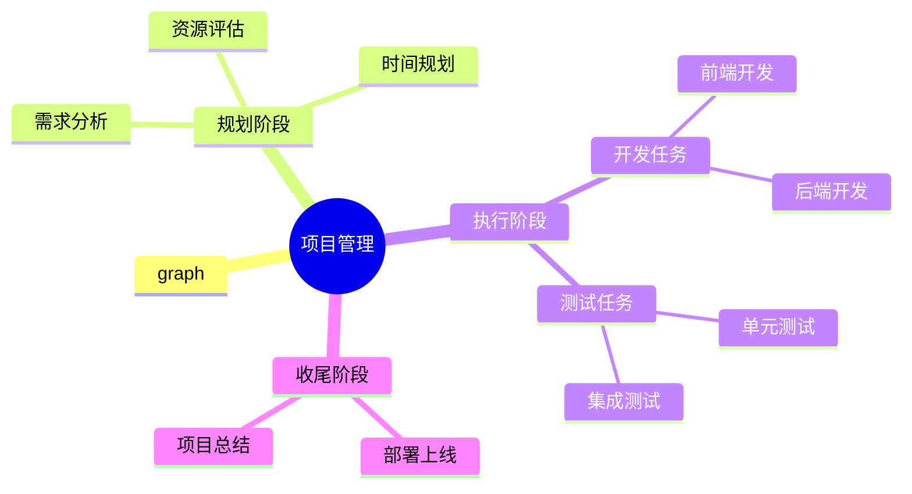

> Written with [StackEdit中文版](https://stackedit.cn/).

> Neural Operator

[TOC]

梳理神经算子（Neural Operators, NO）领域的发展，可以将其视为从“经典算子逼近”到“通用物理基础模型”的演进。以下是基于谷歌学术（Google Scholar）及 2024-2026 年最新顶会（NeurIPS, ICLR, CVPR）研究现状整理的综述大纲：

----------

## 一、神经算子领域发展综述（2019 - 2026）我要看看你你能弄多长到底多长啊

### 1. 奠基阶段：架构的多样化探索 (2019 - 2021)

这一阶段解决了如何定义“算子学习”这一核心问题，即学习函数空间到函数空间的映射 $\mathcal{G}: \mathcal{A} \to \mathcal{U}$。

-   **[DeepONet](#4.deeponet) (Deep Operator Network):** * **文献:** Lu et al. (2019/2021), _Nature Machine Intelligence_.
    
    -   **核心:** 基于算子逼近定理，将算子分解为 **Branch net**（输入函数编码）和 **Trunk net**（演化坐标编码）的内积。它是目前处理参数化输入最通用的框架之一。
        
-   **FNO (Fourier Neural Operator):** * **文献:** Li et al. (2020), _ICLR_.
    
    -   **核心:** 利用卷积定理在频域通过 **FFT** 执行核积分（Kernel Integration）。其核心优势是**分辨率不变性**和对平滑 PDE 极高的求解效率。
        
-   **GNO (Graph Neural Operator):** * **文献:** Li et al. (2020), _NeurIPS_.
    
    -   **核心:** 引入图神经网络（GNN）的消息传递机制，解决了 FNO 无法直接处理**非结构化网格**和复杂边界几何的问题。
        

----------

### 2. 增强阶段：物理一致性与几何适配 (2021 - 2023)

研究重点转向如何让模型“懂物理”以及适配工业级的复杂场景。

-   **PINO (Physics-Informed Neural Operator):** *  **文献:** Li et al. (2021).
    -   **现状:** 将 PDE 残差作为正则项加入 NO。相比于单纯的 PINNs，PINO 具有更强的泛化能力（一次训练，多次推理）。
        
-   **GINO (Geometry-Informed Neural Operator):** * **文献:** Li et al. (2023), _CVPR_.
    -   **突破:** 通过积分算子的离散化，将不规则几何映射到潜空间的规则网格上，使得 FNO 可以应用于复杂的 3D 工业设计（如汽车外部流体分析）。
        
-   **LSM (Learned Spectral Mesh):** 引入了在流行（Manifold）上进行算子学习的思想。
    

----------

### 3. 前沿阶段：基础模型与通用化 (2024 - 2026)

当前该领域的研究热点在于**尺度扩展（Scaling）**、**生成式建模**以及**跨任务泛化**。

#### A. PDE 基础模型 (PDE Foundation Models)

-   **PROSE-PDE:** (_Towards a Foundation Model for Partial Differential Equations_, 2024) 探索了跨多种物理场的预训练，通过多模态（符号与数据）结合来增强泛化能力。
    
-   **Generative PDE Models (2025):** 最新的研究（如 NeurIPS 2025 论文 _Bridging Neural Operator and Flow Matching_）开始将 **Flow Matching** 或扩散模型与神经算子结合。这使得模型不仅能预测均值，还能捕捉物理系统中的不确定性。
    

#### B. 架构演进与 Transformer 化

-   **O-Transformer:** 研究者发现 Transformer 的自注意力机制本质上是一种非局部的核积分。
    
-   **F-Adapter (2025):** 针对科学机器学习（SciML）的参数高效微调（PEFT）技术，使得在超大型 PDE 数据集上微调预训练算子变得可行。
    

#### C. 工业级基准与主动学习 (2025-2026)

-   **最新基准:** 2025 年末发表的 _A comprehensive comparison of neural operators for 3D industry-scale engineering designs_ 提供了首个针对 3D 工业零件的公平对比框架。
    
-   **物理辅助主动学习:** 2026 年初的研究（如 _Data-efficient NO training via physics-based active learning_）利用 PDE 残差指导样本选择，大幅降低了对昂贵模拟数据的依赖。

### 4.DeepONet

#### (1)算子的通用逼近定理

----------
## 二、PINN

**PINNs** 的全称是 **Physics-Informed Neural Networks**（物理信息神经网络）。如果说普通的神经网络是“通过大量数据暴力学习规律”的黑盒，那么 PINNs 就是**“带着物理课本去考试”**的智能模型。

它是由 Raissi 等人在 2019 年正式提出的（论文发表于 _Journal of Computational Physics_），目前已成为 AI for Science 领域最经典的基础架构之一。

说实话对于PDE问题求解时，其就是用神经网络去建模所求函数u方程，即神经网络就是一个函数$u$，若自变量是$x,t$，那么神经网络就是$u(x,t)$
然后在损失函数下功夫，损失函数分为两部分：
- **初始条件和边界条件**：初边界条件做约束比较容易理解，直接计算模型的输出在初始和边界时和条件的MSE即可
- **微分方程**：微分方程表达式做mse，注意内部点没有真实标签，所以要用预测的$\hat{u}$，反向传播计算出偏导，代入PDE方程，计算方程等于0的绝对误差

对于训练集，其实就是在定义域内找点，初始和边界的点，有真值，直接mse计算。内部的点，没有真值，只受方程约束，因此计算方程的loss
当然边界和初始的点也受方程约束

## GNO

你好！我是深耕AI与金融交叉领域的专家。在金融工程中，偏微分方程（PDEs）（如著名的Black-Scholes方程）被广泛用于期权定价和风险管理中。传统数值解法往往耗时且依赖网格，而这篇题为《Neural Operator: Graph Kernel Network for Partial Differential Equations》的论文提出了一种极具前瞻性的AI求解范式。

为了让你清晰掌握这篇论文的核心精髓，我将严格按照你的要求，用通俗易懂且专业严谨的语言为你拆解这四个任务：

---

### 任务一：论文总结、创新点与工作重心

**论文总结：**
本文提出了一种全新的神经网络架构——**神经算子（Neural Operator）**，并具体通过**图核网络（Graph Kernel Network, GKN）**来实现。传统的神经网络通常只能学习有限维向量空间之间的映射（比如把固定尺寸的图片映射到分类标签），而本文的模型能够学习**无限维函数空间之间的映射**（即“算子”，Operator）。在此场景中，模型被用来学习偏微分方程（PDE）的输入参数（如系数函数）到输出解（如目标函数）的映射。

**创新点：**
1. **网格无关性（Mesh-Independence）/离散化不变性**：这是最大的创新。模型在某一种分辨率（比如16×16的粗糙网格）下训练完成的参数，可以直接用于另一种分辨率（比如241×241的精细网格）的预测，且精度保持一致。
2. **结合Nyström近似与图神经网络**：巧妙利用Nyström扩展将连续的积分算子近似为离散图上的消息传递（Message Passing），极大地降低了计算复杂度。
3. **黑盒纯数据驱动**：模型不需要事先知道PDE的具体物理公式，仅凭输入输出对的数据就能学到映射关系。

**工作重心：**
设计一种底层基于“核积分（Kernel Integration）”的深度学习架构，摆脱传统CNN或物理信息神经网络（PINN）严重依赖网格分辨率和需要重复优化的痛点，实现一种“训练一次，到处（任意网格/坐标）推断”的高效PDE求解器。

---

### 任务二：技术背景与原理解析

**1. 传统数值方法与AI方法的痛点**
*   **传统解法（如有限元、有限差分）**：需要将连续的物理空间切分成网格（Mesh）。一旦方程参数改变，就需要从头再算一遍，计算成本极高。
*   **现有的AI方法1（如CNN）**：把PDE问题当作图像翻译（Image-to-Image）。输入是64×64的参数图，输出是64×64的解。**痛点**：极其依赖网格，如果测试时给一张128×128的输入，CNN的结构就失效或误差暴增。
*   **现有的AI方法2（如PINN）**：直接用神经网络去拟合连续的解 $u(x)$。**痛点**：对于每一个新的方程参数，PINN都需要重新训练网络去优化损失，它本质上不是在学习“算子”（举一反三），而是在暴力求解单一问题。

**2. 核心理论原理：格林函数（Green's Function）**
论文的核心灵感来源于数学中求解线性PDE的经典工具——格林函数。
对于一个线性PDE（比如 $L_a u(x) = f(x)$），它的解 $u(x)$ 可以表示为对输入 $f(y)$ 在空间上的积分：
$$u(x) = \int_D G_a(x, y) f(y) dy$$
其中，$G_a(x,y)$ 就是格林函数。它衡量了空间中 $y$ 点的变化对 $x$ 点结果的影响。
**作者的思考**：既然数学上解可以写成“积分”的形式，我们是不是可以用神经网络来学习这个未知的“格林函数（积分核）”，然后用图神经网络的邻居聚合（求和）来近似这个积分（求导）？这就是整篇论文的理论基石。

---

### 任务三：提出的方法及其原理（重点详述）

论文提出的**图核网络（GKN）**就是一个模拟积分过程的神经网络。

#### 1. 模型的输入输出
*   **输入**：空间域被离散化成了 $K$ 个节点（可以是不规则散点，也可以是规则网格）。每个节点 $x$ 的特征包含了它的坐标 $x$、该点的PDE系数 $a(x)$、以及经过高斯平滑后的 $a_\epsilon(x)$ 和梯度 $\nabla a_\epsilon(x)$。总特征维度为 $2(d+1)$ （其中 $d$ 是空间坐标的维度）。
*   **输出**：每个节点上的标量解 $u(x) \in \mathbb{R}$。

#### 2. 模型模块与数据流变化
整个模型分为三个阶段：**升维（Lifting）** -> **迭代积分（Iterative Kernel Integration）** -> **降维投影（Projection）**。

**模块 A：升维初始化层 (Initialization)**
*   **公式**：$v_0(x) = P(x, a(x), a_\epsilon(x), \nabla a_\epsilon(x)) + p$
*   **原理与数据流**：输入数据只是低维特征（比如平面空间 $d=2$ 时，特征维度是 $2\times(2+1)=6$维）。我们首先通过一个浅层神经网络（权重矩阵 $P$），将这 6 维特征映射（Lifting）到一个高维的隐藏状态空间中，维度变为 $n$（例如 $n=64$）。此时，图上每个节点 $x$ 都有了一个初始的 $n$ 维向量 $v_0(x)$。

**模块 B：迭代积分层（核心模块，对应图消息传递）**
*   **公式**：
    $$v_{t+1}(x) = \sigma \left( W v_t(x) + \frac{1}{|N(x)|} \sum_{y \in N(x)} \kappa_\phi(e(x, y)) v_t(y) \right)$$
*   **原理解析与字母含义**：
    *   $t$ 代表迭代步数（网络层数），从 $0$ 到 $T-1$。
    *   $v_t(x) \in \mathbb{R}^n$：第 $t$ 层时节点 $x$ 的隐藏特征（维度始终保持 $n$）。
    *   $W \in \mathbb{R}^{n \times n}$：一个可学习的线性变换矩阵，用于保留节点自身的历史信息。
    *   $N(x)$：节点 $x$ 的邻居集合（在物理空间中距离 $x$ 为半径 $r$ 范围内的点）。
    *   $\sigma$：非线性激活函数（如 ReLU）。
    *   **$\kappa_\phi(e(x,y))$（重中之重）**：这是一个被称为**核网络 (Kernel Network)** 的子多层感知机（MLP），参数为 $\phi$。它的**输入是边特征** $e(x, y) = (x, y, a(x), a(y))$（维度也是 $2(d+1)$），代表两个节点之间的空间位置和物理属性差异。它的**输出是一个 $n \times n$ 的矩阵**。
*   **数据流变化**：在每次迭代中，对于节点 $x$：
    1.  从邻居 $y$ 处获取其特征 $v_t(y)$（$n \times 1$ 的向量）。
    2.  根据 $x$ 和 $y$ 的相对关系输入给 $\kappa_\phi$，生成一个 $n \times n$ 的权重矩阵。
    3.  用这个权重矩阵乘以 $v_t(y)$，完成一次消息的加权计算（输出仍为 $n \times 1$ 向量）。
    4.  把所有邻居传来的消息求平均（这就是蒙特卡洛积分的离散化近似）。
    5.  加上节点 $x$ 自身的线性变换 $W v_t(x)$，最后通过激活函数 $\sigma$。
    完成一次迭代后，节点特征维度依旧是 $n$，但吸收了周围 $r$ 半径内的信息。迭代 $T$ 次，相当于感受野逐渐扩大，模拟了全局积分。

**加速模块：Nyström 近似**
*   如果图上有 $K$ 个节点，计算全连接图的复杂度是 $O(K^2)$，这太慢了。
*   作者引入 Nyström 近似：在训练时，不计算所有的 $K$ 个点，而是随机在图中采样 $m$ 个点（$m \ll K$，比如总共数万个点，只采样200个点）组成子图进行训练。这样复杂度降为了 $O(m^2)$。这就是为什么它能在任意不规则网格上即插即用，且极其高效的原因。

**模块 C：投影输出层 (Projection)**
*   **公式**：$u(x) = Q v_T(x) + q$
*   **原理与数据流**：经过 $T$ 次迭代后，我们得到了包含充分邻域信息的最终高维表示 $v_T(x) \in \mathbb{R}^n$。最后通过一个简单的线性变换网络 $Q$（维度为 $1 \times n$），将其从 $n$ 维映射回 $1$ 维，得到方程在该点的预测解 $u(x)$。

---

### 任务四：实验部分简述

**1. 数据集**
作者基于经典的二阶椭圆偏微分方程（如达西渗流方程 / 泊松方程）构建了 2D 的数据集。空间域定义在 $D = [0,1]^2$。
输入数据 $a(x)$ 是分段的常数函数，具有随机的几何形状（模拟材料属性或地下渗流场的渗透率分布）。真实的输出解 $u(x)$ 是由传统的二阶有限差分法在极精细的 241×241 网格上计算得到的基准真值。

**2. 对比的基线模型 (Baselines)**
*   **NN**：最基础的逐点前馈神经网络（由于缺乏邻居节点信息交互，效果很差）。
*   **FCN（全卷积网络）**：当时最先进的基于CNN的PDE求解网络。缺点是严重依赖网格尺寸。
*   **PCA+NN**：对输入输出做主成分分析降维后插值的神经网络（虽然可以脱离网格限制，但仅能在训练使用过的同等网格上评估）。
*   **RBM（降阶基方法）**：经典数值分析方法（效果好，但非纯数据驱动，需知道方程物理内涵且依赖特定网格）。

**3. 评价指标**
*   **相对 $L_2$ 误差（Relative $L_2$ error）**：衡量模型预测出的函数与真实解在整个空间域上的均方根误差之比。

**4. 实验核心结论**
*   **超强泛化（跨分辨率）**：把 GKN 在 16×16 这样极其粗糙的低分辨率网格上训练，然后直接拿到 241×241 的高分辨率网格上测试，误差依然稳定（在 5% 左右），而 FCN 这种基于 CNN 的模型在改变分辨率后直接失效。
*   **半监督能力**：只需在训练时给一小部分散点数据（例如从原图中随机抽200个点），模型就能学会背后的积分核，进而在整张图上预测。

**总结而言**，作为一名金融AI工作者，我必须指出：这篇论文提出了一种跳出“像素到像素”的降维打击思维。它通过把高深的泛函分析（积分算子）与图神经网络（消息传递）结合，使得深度学习彻底摆脱了固定网格的限制。这种思想不仅仅在流体力学中有用，未来在解高维偏微分方程的金融期权定价（如通过随机偏微分方程解算）领域，同样具有巨大的降维加速潜力。

# GNO for IVS

你好！作为一名在金融AI领域的专家，我非常高兴为你解读这篇极具前瞻性的论文《OPERATOR DEEP SMOOTHING FOR IMPLIED VOLATILITY》（期权隐含波动率的算子深度平滑）。

这篇论文巧妙地将前沿的**神经算子（Neural Operators）**引入了金融工程中最经典且最具挑战性的问题之一：**期权隐含波动率曲面平滑**。以下是为你量身定制的详细拆解：

---

### 任务一：论文总结、创新点与工作重心

**论文总结：**
本文提出了一种名为“算子深度平滑”（Operator Deep Smoothing, OpDS）的新方法，用于处理期权市场中的隐含波动率平滑问题。与传统每次市场更新都需要重新求解最优化问题的参数化方法（如SVI模型）不同，该方法通过离线训练一个**图神经算子（Graph Neural Operator, GNO）**，在在线推理时只需一次前向传播，即可直接将动态、不规则的离散市场报价映射为平滑且无套利的隐含波动率曲面。

**核心创新点（去废话版）：**
1. **金融领域的首次神经算子应用**：首次将神经算子技术应用于金融工程中的插值/外推问题（即波动率平滑）。
2. **离散不变性（Discretization-Invariant）**：突破了传统神经网络需要固定维度输入的限制。由于期权市场每天挂牌的行权价和到期日数量和位置都在动态变化，GNO能够完美适应任意大小和空间排列的输入数据。
3. **改进的插值GNO架构**：针对传统GNO不支持对未观测点直接输出的问题，修改了第一层网络结构（去除了局部线性变换，仅保留非局部积分），使其能够作为纯插值/外推工具。
4. **融合硬核金融约束**：在损失函数中深度融合了无静态套利（Static Arbitrage-Free）的数学硬约束（日历套利与蝶式套利条件）。

**工作重心：**
开发一种高精度、高效率、且满足金融无套利约束的神经网络模型，以替代传统高耗时的实例级参数优化方法，从而让深度学习能够在高频、大规模的历史期权数据集上进行普适性的曲面平滑。

---

### 任务二：技术背景与原理

**1. 隐含波动率平滑（Implied Volatility Smoothing）背景**
*   **什么是隐含波动率（IV）**：在Black-Scholes（BS）期权定价模型中，除了标的资产的波动率 $v$ 外，其他参数（价格、行权价、到期时间、利率）均是已知的。将市场上的期权真实交易价格代入BS公式反推出来的 $v$，就是隐含波动率。
*   **平滑的意义**：市场上的期权报价是离散的（仅在特定的到期时间 $\tau$ 和对数资金要求 $k$ 上有报价），且存在买卖价差（噪声）。我们需要用一个连续的二维曲面函数 $\hat{v}(\tau, k)$ 来拟合这些离散点，以便为市场上没有挂牌的任意条款的期权定价（插值/外推）。
*   **无套利约束（核心挑战）**：拟合出的曲面不能让交易员存在“稳赚不赔”的套利机会。数学上必须满足定理2.1：
    *   **日历套利（Calendar Arbitrage）**：曲面沿着到期时间 $\tau$ 必须是非递减的。
    *   **行权价套利（Strike Arbitrage / Butterfly）**：曲面沿着对数资金要求 $k$ 的切片必须满足特定的二阶导数非负条件（$\text{But}$ 函数 $\ge 0$）。

**2. 神经算子（Neural Operators, NO）原理**
*   **传统NN的局限**：传统神经网络（如MLP、CNN）是在有限维欧几里得空间中学习映射（比如 $\mathbb{R}^n \to \mathbb{R}^m$），输入维度 $n$ 必须固定。但在期权市场，前一分钟有500个报价点，下一分钟可能变成505个，且坐标 $(\tau, k)$ 全部变了。
*   **神经算子的降维打击**：神经算子学习的是**无穷维函数空间之间的映射** $\mathcal{F}: \mathcal{A} \to \mathcal{U}$。它认为你输入的离散数据点，只是某个隐式连续函数 $a(x)$ 在特定离散网格上的采样。
*   **图神经算子（GNO）**：GNO通过核积分变换（Kernel Integral Transform）来实现算子学习。为了计算在连续空间上积分，GNO将其近似为在图结构（Graph）上的消息传递求和。输入点和输出点作为图的节点，根据空间距离连接边，从而实现“离散不变性”。

---

### 任务三：提出的方法及原理（核心重点）

#### 1. 如何将波动率平滑转化为“算子学习”问题？
这是本论文最精彩的切入点：
*   **经典算子学习**：通常用于解偏微分方程（输入初始条件函数，输出未来时刻的解函数）。
*   **平滑问题的算子化**：作者将真实的、连续的隐含波动率曲面假设为一个隐变量函数 $v: D \to \mathbb{R}$（定义在到期日和行权价组成的定义域 $D$ 上）。我们观测到的市场数据 $\mathbf{v} = v|_\pi$，只是该函数在有限个不规则坐标点集合 $\pi = \{x_1, \dots, x_p\}$ 上的求值。
*   **目标算子**：我们的目标是学习一个**恒等算子（Identity Operator）** $\mathcal{F}_{\text{id}}(v) = v$。
*   **模型训练**：训练一个参数化的图神经算子 $\tilde{F}^\theta$，让它接收离散的、随时变化的采样点 $\mathbf{v}$，能够吐出整个连续空间的预测值。即对于任意给定的查询点 $x \in D$（不论这个点在不在输入数据里），它都能输出 $\hat{v}(x) \approx v(x)$。这样，**数据拟合与插值问题，就被完美转化为了一个连续函数空间上的算子逼近问题**。

#### 2. 模型的输入输出与数据流模块
为了在计算时更稳定，作者将坐标转换为了 $\rho = \sqrt{\tau}$ 和 $z = k/\rho$。模型定义域为二维坐标点 $x = (\rho, z)$。

*   **模型输入**：
    观测到的期权隐含波动率点集 $\mathbf{v} = \{v(x)\}_{x \in \pi_{\text{in}}}$。维度为 $N_{\text{in}} \times 3$（包含坐标 $\rho, z$ 和对应的波动率值 $v$）。查询输出的目标位置集 $\pi_{\text{out}}$（维度为 $N_{\text{out}} \times 2$）。

*   **内部模块与数据流变化**：

    **步骤0：图构造模块（Graph Construction - Nyström近似）**
    对于每个我们要预测的目标点 $y \in \pi_{\text{out}}$，通过计算欧式距离，在输入点集 $\pi_{\text{in}}$ 中找到离它最近的 $K$ 个邻居点（作者设定 $K=50$），建立图的有向边。这定义了感受野 $\mathcal{N}_{\text{in}}(y)$。

    **步骤1：提升层（Lifting Layer）**
    只在输入点 $x \in \pi_{\text{in}}$ 上操作。通过全连接网络（MLP） $\mathcal{P}_0$，将标量输入 $v(x)$ 映射到高维隐藏特征空间。
    *   *维度变化*：$1 \to c_0$ (实验中设通道数 $c_0=16$)。
    *   *公式*：$\tilde{h}_0(x) = \mathcal{P}_0(v(x))$

    **步骤2：纯非局部积分层（第一层，解决插值问题的关键）**
    传统GNO每一层包含局部线性变换（仅针对自身节点）和非局部积分（针对邻居节点）。**但如果要预测的输出点 $y$ 在输入序列中不存在，局部变换就无法进行。** 因此，作者在第1层**丢弃了局部线性变换**，纯靠邻居节点 $\mathcal{N}_{\text{in}}(y)$ 的核积分来生成目标点 $y$ 的初始隐状态。
    *   *原理*：核函数 $\kappa_0$ 作为一个MLP，接收边特征（$y, x, \tilde{h}_0(x), v(x)$），输出一个 $16 \times 16$ 的权重矩阵。通过在邻居节点上加权求和，将信息汇聚到目标点 $y$。
    *   *公式*：$h_1(y) = (\sigma_0 \circ \mathcal{Q}_0) \Big( \mathcal{K}_0(\tilde{h}_0; \mathbf{v})(y) + b_0 \Big)$。此时，哪怕 $y$ 是全新的网格点，也获得了维度为 16 的隐特征。

    **步骤3：后续GNO隐藏层（第 $j=1 \dots J-1$ 层）**
    由于在上一步所有输出点 $y$ 都已经有了隐状态，后续层可以同时使用局部线性变换 $W_j$（保留自身特征）和核积分变换 $\mathcal{K}_j$（吸收邻居特征）。
    *   *维度变化*：隐特征维持 $16 \to 16$ 维度流动，激活函数使用 GELU。
    *   *公式*：$h_{j+1}(y) = (\sigma_j \circ \mathcal{Q}_j) \Big( W_j \tilde{h}_j(y) + \mathcal{K}_j(\tilde{h}_j; \mathbf{v})(y) + b_j \Big)$

    **步骤4：投影层（Projection Layer）**
    最后一层经过全连接网络 $\mathcal{Q}_J$ 和 Softplus激活函数（保证波动率为正数），将高维隐状态映射回标量预测值。
    *   *维度变化*：$16 \to 1$。

*   **模型输出**：
    目标点 $y$ 的平滑后的连续隐含波动率预测值 $\hat{v}(y)$。

#### 3. 物理/金融先验驱动的损失函数（Loss Function）
由于纯数据驱动的神经网络容易产生套利，作者设计了强力的联合损失函数：
$\mathcal{L} = \lambda_{\text{fit}}\mathcal{L}_{\text{fit}} + \lambda_{\text{but}}\mathcal{L}_{\text{but}} + \lambda_{\text{cal}}\mathcal{L}_{\text{cal}} + \lambda_{\text{reg}}\mathcal{L}_{\text{reg}}$
1.  **拟合损失 $\mathcal{L}_{\text{fit}}$**：计算预测值与真实离散输入点的相对误差。作者还巧妙地加入了Black-Scholes Vega（期权价格对波动率的敏感度）作为权重，Vega越大的期权，权重越高（因为其价格误差影响更大）。
2.  **蝶式套利惩罚 $\mathcal{L}_{\text{but}}$**：在合成的密集网格上，用有限差分法计算二阶导数函数 $\text{But}(x, \hat{v}, \partial_z \hat{v}, \partial^2_z \hat{v})$。如果该值小于容忍度 $\varepsilon$，则产生惩罚（使用 L1 范数促进稀疏惩罚）。
3.  **日历套利惩罚 $\mathcal{L}_{\text{cal}}$**：沿着 $\rho$（时间）方向计算导数，确保波动率曲面随时间单调递增。若违反单调性，则施加惩罚。
4.  **正则化 $\mathcal{L}_{\text{reg}}$**：计算输出曲面在时间和行权价方向上的拉普拉斯算子（二阶导），促使生成的曲面在视觉和数值上极其平滑。

---

### 任务四：实验部分简要介绍

**1. 数据集**
*   **训练与验证集**：使用芝加哥期权交易所（CBOE）**标普500指数（S&P 500）** 2012年至2020年的高频盘中数据（每20分钟一个切片，共产生超4万个曲面和6千万个数据点）。
*   **测试集**：
    *   同分布测试：S&P 500 在2021年全年的高频数据。
    *   **泛化性测试**（极大亮点）：模型在**未经过任何训练**的情况下，直接在其他三大指数——纳斯达克100（NDX）、道琼斯（DJX）、罗素2000（RUT）的日终（End-of-day）数据上进行测试，展现出极强的零样本泛化能力。

**2. 评价指标**
*   **表面平均绝对百分比误差（MAPE / $\langle \delta_{\text{abs}} \rangle$）**：衡量平滑后曲面和原始市场离散报价点之间的相对偏差。
*   **买卖价差内比例（$\langle \delta_{\text{spr}} \rangle$）**：衡量预测的名义价格误差相对于期权买卖价差的大小。只要该值 $\le 1$，意味着模型的定价落在市场的实际买卖报价区间内（这是交易员最看重的指标）。
*   **套利损失评估**：统计 $\mathcal{L}_{\text{but}}$ 和 $\mathcal{L}_{\text{cal}}$ 的平均值，以此证明生成的曲面不存在静态套利。

**3. 对比基线（Baselines）**
*   **工业界标准（SVI）**：Gatheral 提出的经典参数化随机波动率启发模型，使用带约束的SLSQP优化器针对每一个历史截面单独进行校准。
*   **经典神经网络架构（Deep Smoothing / DS，Ackerer等 2020）**：当前最优的深度学习方案之一，但该方案是“实例级”的——即需要针对**每一个曲面单独训练一个神经网络**（测试集如果有一万个时间点，就需要训练一万次神经网络），而本文的方法（OpDS）是一个网络跑通全历史数据。

**实验结果结论：**
本方法的预测MAPE（约0.5%）和买卖价差拟合度均大幅优于工业界标准SVI（1%~2%）。更重要的是，生成一个曲面的推理时间极短，且完美满足无套利要求；相较于传统的神经网络方法（DS），在参数量和时间成本上实现了指数级的压缩（一个模型 vs 几万个模型）。
<!--stackedit_data:
eyJoaXN0b3J5IjpbLTI5MDE0MTAzNiwtMTA5NjE3OTE4XX0=
-->